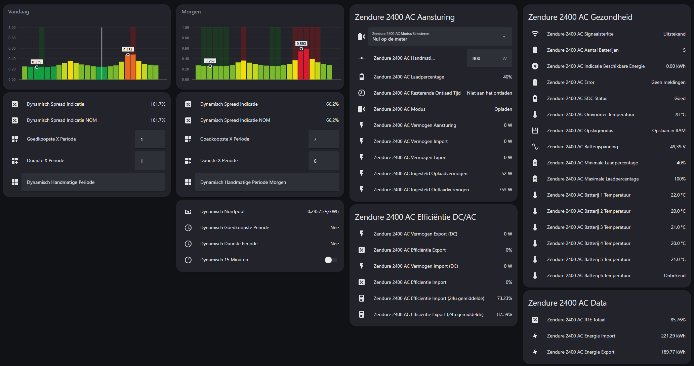
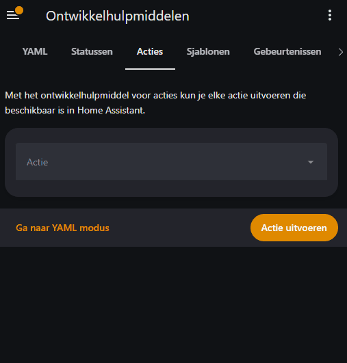

#  Zendure - Home Assistant
**Om in 3️⃣ stappen je batterij werkend te krijgen in Home Assistant**.

Gebaseerd op de [zenSDK RESTful API](https://github.com/Zendure/zenSDK) voor Home Assistant. Deze setup maakt lokaal verbinding met één Zendure Solarflow 2400 AC / Zendure Solarflow 800 Pro (geen aangesloten zonnepanelen) zonder gebruik te maken van integraties maar werkt met **één automatisering**. Voor de gene die graag de thuisbatterij 100% lokaal in eigen beheer wilt zonder updates van derden en netjes in Home Assistant.

Vind je dit project leuk en wil je mij steunen? Trakteer mij dan op een kopje koffie ☕️ – ik codeer beter met cafeïne!

  

## 1️⃣ Configuration.yaml

> ⚠️ Let op: Zorg ervoor dat **HEMS is uitgeschakeld** in de Zendure-app.

Daarna gaan wij alles aanmaken voor de RESTful integratie (zit standaard in HA). Hiervoor heb ik een bijna plug-n-play Configuration.yaml gemaakt.
#### ℹ️ Benodigde hardware

- Homewizard P1 (of een andere P1/CT-meter die data per seconde levert)
- één Zendure Solarflow 2400 AC / Zendure Solarflow 800 Pro (geen aangesloten zonnepanelen)

#### ℹ️ Vereiste gegevens

| Variabele            | Waar te vinden                                 |
|----------------------|------------------------------------------------|
| `<IP-BATTERIJ>`      | In de Zendure app onder device Information |
| `<SERIAL-2400AC>`    | In de Zendure app onder device Information  |
| `<IP-HOMEWIZARD-P1>` | In de Homewizard app (lokale API aanzetten) |
| `<NORDPOOL>         ` | Optioneel de eniteit van Nordpool toevoegen |

---

### #️⃣ Configuratie en herstart

1. Maak eerst een **backup** van je `configuration.yaml`
2. Pas daarna je `configuration.yaml` aan door gebruik te maken van de Github `configuration.yaml` en vervang de **vereiste gegevens** zoals hierboven aangegeven
3. Herstart Home Assistant
4. Na herstarten zie je onder integraties het onderstaande verschijnen

*Zelf toe te voegen entiteiten op een dashboard.
 

---

### #️⃣ Testen

Ga naar **Ontwikkelhulpmiddelen** in Home Assistant. Zoek onder "Acties" naar **Zendure**.

1. Voer **Snel opladen** uit  
   > ⚠️ Let op: 2400 watt. Respecteert ingestelde limieten uit de app.

2. Daarna kun je **Stop met alles** uitvoeren

##### YAML niet goed ingeladen?

Als je sensoren ziet maar geen **rest_commands**:  
> 🔁 Bug in Home Assistant – herstart meerdere keren totdat alles goed ingeladen is.

  

## 2️⃣ Zendure zenSDK (Gielz) automatisering
De motor van alles. Deze zal slim opladen en slim ontladen en samen dansen tot één geheel. Heb je bij het bovenstaande geen namen aangepast dan is het een kwestie van een nieuwe automatisering aanmaken.

1. Maak een nieuwe automatisering aan
2. Klik rechtsboven op **Bewerken in YAML**
3. Plak de YAML-code `(zie automatisering bestand)`
4. Sla op, en start de automatisering

   

 

  

## 3️⃣ Batterij mag aan de slag
Het is dan eindelijk zo ver de batterij mag eens laten zien wat hij kan.

1. Voeg de entiteit **Zendure 2400 AC Modus Selecteren** toe aan je dashboard
2. Voeg eventueel andere entiteiten toe die je via de `configuration.yaml` hebt aangemaakt
3. De modus zal op **Standby** staan
4. Kies hier je gewenste modus om de **Zendure zenSDK (Gielz) automatisering** te activeren
5. De batterij zal nu aan de slag gaan

 

  

## 🔃 (Optioneel) Nordpool
Wanneer je ook het Dynamisch Nordpool gedeelte in gebruik gaat nemen moet je voor dat je deze in gebruik neemt bij input_text.dynamisch_handmatige_periode en
input_text.dynamisch_handmatige_periode_morgen even unknown weghalen. Hierna zal het dynamisch gedeelte werken. Alles wat in de forecast gezet word zal overgenomen worden om 00:00 via de automatisering.

Dynamisch Goedkoopste Periode en Dynamisch Duurste Periode geven JA en NEE aan. deze kun je vervolgens in je eigen automatisering gebruiken waarmee je de modus van de batterij veranderd.

### #️⃣ Apexcharts
Je kunt om het visueel aantrekkelijk te maken de Apexcharts `Nordpool_Apexcharts_Vandaag` en `Nordpool_Apexcharts_Morgen` gebruiken `(zie Github bestanden)`

### Slim laden met behulp van Dynamisch HA
De toevoeging aan deze fork is dat binnen NOM, ook 'slim' laden gebruikt wordt. Hiervoor heb je wel Dynamisch HA nodig. Nieuwe sensor [dynamisch_goedkope_uren_nu] wordt aangemaakt en haalt op basis van NordPool + Dynamisch HA, een klein set aan data wat de goedkoopste momenten zijn. Aanpassingen aan [input_number.dynamisch_goedkoopste_x_periode] en [input_number.dynamisch_duurste_x_periode] hebben invloed op hoe vaak je laadt. 
Je kunt het aanpassen op 15 minuten of 60 minuten (zie [input_boolean.dynamisch_15_minuten]). 
Bron: https://github.com/Gielz1986/Dynamisch-HA
