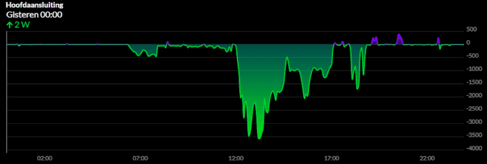
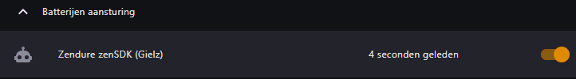
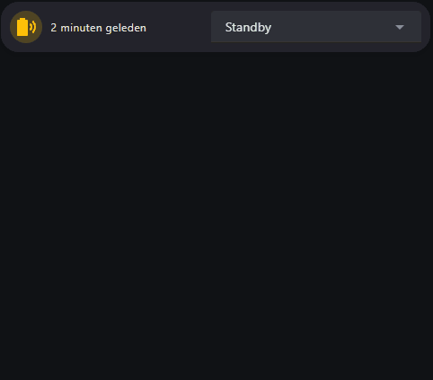

## ⚡ Zendure zenSDK (Home Assistant)

Gebaseerd op de [zenSDK van Zendure](https://github.com/Zendure/zenSDK). Deze setup maakt lokaal verbinding met **één** Zendure Solarflow 2400 AC batterij zonder gebruik te maken van integraties maar werkt met **één automatisering**. Voor de gene die graag de batterij 100% lokaal in eigen beheer wilt zonder updates van derden.

---

### 📦 (1/3) Entiteiten configuratie in de configuration.yaml

> ⚠️ Zorg ervoor dat **HEMS is uitgeschakeld** in de Zendure-app.

Daarna gaan wij alles aanmaken voor de restful integratie (zit standaard in HA). Hiervoor heb ik een bijna plug-n-play Configuration.yaml gemaakt.
#### Benodigde hardware

- Homewizard P1 (of een andere P1-meter die data per seconde levert)
- Zendure Solarflow 2400 AC  

#### Vereiste gegevens

| Variabele            | Waar te vinden                                 |
|----------------------|------------------------------------------------|
| `<IP-BATTERIJ>`      | In de Zendure app onder **Device Information** |
| `<SERIAL-2400AC>`    | In de Zendure app onder **Device Information**  |
| `<IP-HOMEWIZARD-P1>` | In de Homewizard app (lokale API **aanzetten**) |

---

#### Configuratie en herstart

1. Maak eerst een **backup** van je `configuration.yaml`
2. Pas daarna je `configuration.yaml` aan door de vereiste gegevens in te vullen
3. **Herstart Home Assistant**

Na herstarten zie je onder integraties het onderstaande verschijnen.

 

---

#### Testen

Ga naar **Ontwikkelhulpmiddelen** in Home Assistant. Zoek onder "Acties" naar `Zendure`.

1. Voer **Snel ontladen** uit  
   > ⚠️ Let op: 2400 watt. Respecteert ingestelde limieten uit de app.

2. Daarna kun je **Stop met alles** uitvoeren

##### YAML niet goed ingeladen?

Als je sensoren ziet maar geen `rest_commands`:  
> 🔁 Bug in Home Assistant – herstart meerdere keren totdat alles goed ingeladen is.

---

### 🤖 (2/3) Zendure zenSDK (Gielz) automatisering
De motor van alles. Deze zal slim opladen en slim ontladen en samen dansen tot één geheel. Heb je bij het bovenstaande geen namen aangepast dan is het een kwestie van een nieuwe automatisering aanmaken en rechtsboven op bewerken in YAML aan te klikken. Copy en paste en opslaan met deze naam en start daarna de automatisering;

#### Automatisering toevoegen

1. Maak een nieuwe automatisering aan
2. Klik rechtsboven op **Bewerken in YAML**
3. Plak de YAML-code (zie aparte sectie of bestand)
4. Geef het een naam, sla op, en start de automatisering

   

 

---

### 🔋 (3/3) Batterij laten werken

1. Voeg de entiteit **Zendure 2400 AC Modus Selecteren** toe aan je dashboard
2. Voeg eventueel andere entiteiten toe die je via `configuration.yaml` hebt aangemaakt
3. De modus zal op **Standby** staan
4. Kies hier je gewenste modus om de **Zendure zenSDK (Gielz) automatisering** te activeren
5. De batterij zal nu aan de slag gaan

 

